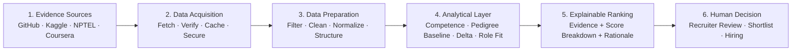
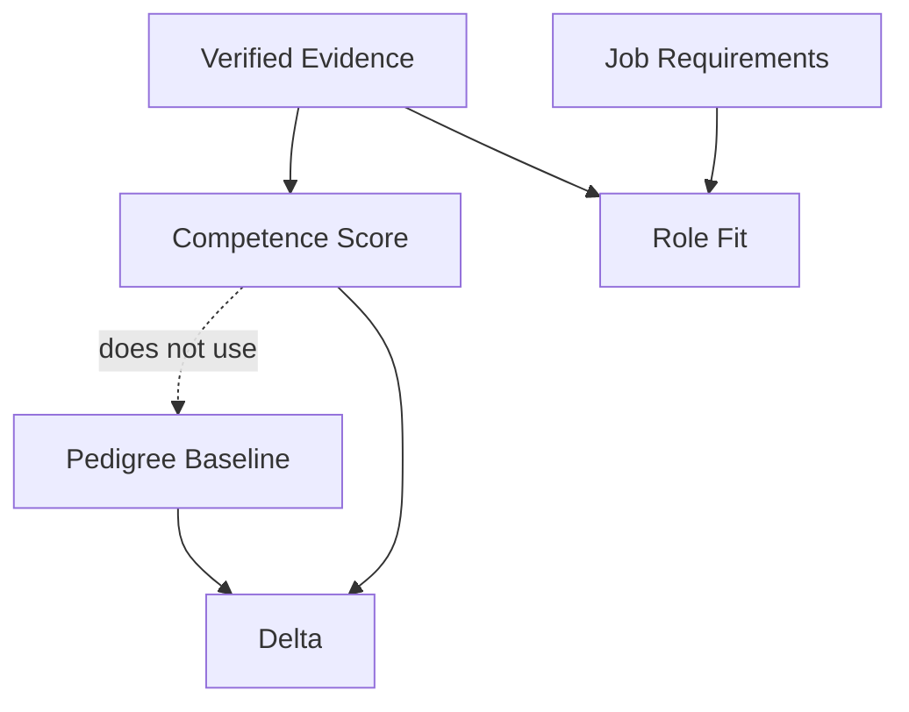

BeyondCV

  
  
  
  
  
  
  
  
  
  
  
  
  

  <strong>Hire for what people can do, not where they studied.</strong>

  An evidence-based talent discovery platform that finds high-potential candidates that résumé screening can overlook.

  Built for <strong>Build For Bharat 2.0</strong> · Problem Statement: <strong>Intelligent Talent and Workforce Ecosystem</strong>

The Idea
Traditional hiring often uses college tier, employer brand and résumé keywords as shortcuts for ability.
BeyondCV adds an evidence layer. Instead of asking only where a candidate studied or worked, it asks:
What has this person actually demonstrated?

The platform separates demonstrated competence from pedigree and surfaces candidates whose evidence is stronger than their conventional background signals suggest.
The Problem
Talented candidates become invisible
A student from a Tier-3 college or a self-taught developer may have strong projects, open-source work and competition results, yet never reach the recruiter because of early-stage pedigree filters.
Skills are difficult to verify at scale
A résumé makes claims. Verifying GitHub repositories, competition performance and certificates manually for hundreds of candidates is expensive and inconsistent.
Pedigree can become a proxy for ability
College and employer reputation can influence screening even though they do not directly measure what a candidate can build.
Our Solution
BeyondCV evaluates publicly verifiable evidence and separates two concepts:
	Competence	Pedigree Baseline
Built from	GitHub, Kaggle and verified certificates	College tier and employer brand
Purpose	Measures demonstrated ability	Estimates expected performance from background signals
Question	What can this person demonstrably do?	What would we expect from their background alone?

The Delta
Delta = Competence − Pedigree Baseline
A positive Delta indicates that demonstrated competence is above what the candidate's background signals would predict.
That is the signal BeyondCV is designed to surface.
Architecture
BeyondCV follows a deliberate evidence → scoring → explanation → human decision pipeline.

Architecture Responsibilities
Layer	Responsibility
1. Evidence Sources	Collect public evidence from GitHub, Kaggle and certificate verification sources.
2. Data Acquisition	Fetch evidence, verify ownership where possible, cache external responses and isolate third-party failures.
3. Data Preparation	Remove low-quality signals, normalize scores to a common scale and structure evidence for analysis.
4. Analytical Layer	Calculate Competence, Pedigree Baseline, Delta and Role Fit independently.
5. Explainable Ranking	Combine role relevance and Delta while retaining the evidence and reasoning behind the result.
6. Human Decision	Recruiters review the evidence and make the final decision. BeyondCV does not make autonomous hiring decisions.

Analytical Layer
The analytical layer is intentionally separated so that college and employer information cannot influence the competence score.

Competence = weighted evidence-source scores
Pedigree Baseline = regression using college tier + employer brand
Delta = Competence − Pedigree Baseline
Role Fit = candidate evidence × required job skills
Ranking = Role Fit + Delta
Evidence Sources
Source	Evidence Used
GitHub	Repositories, activity, READMEs and languages
Kaggle	Competition leaderboard position / performance
NPTEL	Certificate verification evidence
Coursera	Certificate verification evidence

The system prioritizes evidence of ownership and substantive work over unsupported claims.
How It Works
1. Data Acquisition
Candidates link public evidence and the platform collects relevant information.
The acquisition layer is designed to:
- Fetch public evidence
- Verify ownership where possible
- Cache external data with expiry
- Reduce unnecessary third-party requests
- Protect outbound fetching against SSRF
- Handle individual source failures gracefully
A failure in one source should not prevent the candidate from being evaluated using the remaining evidence.
2. Data Preparation
Before scoring, evidence is cleaned and normalized.
- Filter forks and tutorial-style repositories
- Remove or discount low-quality signals
- Normalize different sources to a common 0–100 scale
- Structure evidence into scoreable features
- Label unverified or synthetic/sample evidence
- Cache reusable external results
3. Analytical Approach
Competence Score
A weighted combination of evidence-source scores.
Evidence with stronger proof of ownership receives higher weight. Substantive projects can receive an additional signal through semantic analysis using sentence embeddings.
Pedigree Baseline
A separate regression model uses only:
- College tier
- Employer brand
These signals are intentionally isolated from the competence score.
Delta
Delta = Competence − Pedigree Baseline
A positive Delta means demonstrated competence is above the model's expected baseline.
Role Fit
Role Fit measures how strongly the candidate's demonstrated skills match the requirements of a job.
Role Fit = Evidence × Job Skills
Ranking
The candidate ranking combines:
Role Fit + Delta
The ranking remains explainable by retaining the evidence, component scores and rationale that produced it.
Key Features
- Pedigree-blind competence scoring
- Evidence-based candidate evaluation
- GitHub project and activity analysis
- Kaggle performance analysis
- Certificate evidence
- Competence vs. pedigree separation
- Per-candidate Delta
- Role-specific ranking
- GitHub ownership verification
- Explainable score breakdowns
- Candidate consent controls
- Full data deletion
- Privacy-preserving aggregate insights
- SSRF-safe third-party fetching
- Graceful source-failure handling
- Human-in-the-loop hiring
Example
Imagine two candidates applying for a Backend Engineer role.
Candidate A
- Tier-1 college
- Strong conventional résumé
- Limited public engineering evidence
Candidate B
- Tier-3 college
- Multiple well-documented Django projects
- Strong GitHub evidence
- Kaggle result in the top 10%
A traditional résumé filter may favor Candidate A.
BeyondCV asks:
Who has stronger demonstrated evidence for the actual role?

If Candidate B has strong competence, strong role fit and a large positive Delta, BeyondCV can surface that candidate and explain which evidence contributed to the result.
Explainability
BeyondCV is designed so that a recruiter does not receive only a final number.
A surfaced candidate can be accompanied by:
Candidate
   │
   ├── Evidence Sources
   │     ├── GitHub
   │     ├── Kaggle
   │     └── Certificates
   │
   ├── Competence Score
   ├── Pedigree Baseline
   ├── Delta
   ├── Role Fit
   │
   └── Plain-language rationale
This makes the ranking inspectable rather than a black-box recommendation.
Undervalued Skills Insights
BeyondCV can generate anonymous, aggregate views of skills that appear undervalued across:
- Regions
- College tiers
- Candidate populations
Small groups are suppressed to reduce the possibility of identifying individuals.
These insights can help colleges and workforce programs understand which skills candidates demonstrate that conventional hiring signals may undervalue.
Privacy, Fairness & Ethics
Consent-first
Candidates control whether recruiters can see their information.
Right to erasure
Candidates can delete their account and linked data.
Pedigree isolation
College and employer information feed the baseline model only, not the competence score.
Explainability
Scores expose their underlying evidence and reasoning.
Privacy-safe aggregation
Aggregate insights avoid exposing individual candidates.
Human in the loop
Recruiters remain responsible for the final hiring decision.
Security & Reliability
The platform treats third-party evidence collection as an untrusted boundary.
Security
- SSRF protection for outbound requests
- Ownership verification where supported
- Controlled external fetching
- Expiring cache
- Candidate consent controls
- Data deletion
Reliability
- One failed source does not block the full evaluation
- External data is cached to reduce repeated requests
- Evidence is labelled according to verification status
- Uncertain or incomplete evidence is not presented as certainty
Tech Stack
Layer	Technology
Language	Python 3.x
Backend	Django
API	Django REST Framework
Authentication	JWT
Database	PostgreSQL
Async Processing	Celery
Message / Cache Layer	Redis
ML	scikit-learn
NLP / Semantic Analysis	sentence-transformers
Data Processing	pandas
Deployment	Docker Compose
Reverse Proxy	Nginx
Application Server	Gunicorn

Backend Structure
Beyond-CV-Backend/
│
├── accounts/          # Authentication, users and consent
├── candidates/        # Candidate profiles and evidence
├── evidence/          # Evidence ingestion and verification
├── scoring/           # Competence, pedigree, Delta and role fit
├── ranking/           # Explainable candidate ranking
├── insights/          # Aggregate workforce insights
├── core/              # Shared utilities and configuration
│
├── manage.py
├── requirements.txt
├── Dockerfile
├── docker-compose.yml
└── README.md
Directory names should match the current implementation as the project evolves; the structure above represents the intended backend separation of concerns.

API / Backend Responsibilities
The backend is responsible for:
Authentication
     ↓
Candidate Consent
     ↓
Evidence Ingestion
     ↓
Evidence Verification
     ↓
Data Normalization
     ↓
Scoring
     ↓
Role Matching
     ↓
Explainable Ranking
     ↓
Recruiter Decision Support
This separation keeps ingestion, analysis and decision-support concerns independent and easier to test.
Real-World Impact
Area	Impact
Fairer Hiring	Gives candidates from lower-tier institutions and smaller regions a stronger way to be evaluated on demonstrated ability.
Better Talent Discovery	Helps recruiters discover candidates conventional filters may reject.
Less Manual Screening	Replaces repetitive evidence checking with structured, summarized evidence.
Curriculum Alignment	Shows institutions which skills their students demonstrate.
Transparency	Decision-support outputs can be explained and audited.

Current Limitations
We want to be explicit about what the current system does not prove.
- The Pedigree Baseline is trained on a small synthetic sample.
- Competence scoring uses transparent heuristics that have not yet been validated against real hiring outcomes.
- College tier and employer information are self-reported.
- Kaggle and certificate ownership checks are partial.
- Public evidence is an imperfect proxy for real-world ability.
- Ranking should support, not replace, human judgment.

## Current backend status

The existing backend implements email/JWT authentication, candidate profiles
and evidence links, asynchronous ingestion, score explanations, recruiter job
roles and per-role ranking, aggregate insights, API documentation, and a
dependency-aware health endpoint. The test suite covers these existing
workflows; it does not mean the full BeyondCV target contract is implemented.

The requested STUDENT/HR consent and leaderboard flow, Codeforces integration,
LeetCode/NPTEL unavailable-provider interfaces, external job provider, and ML
contract are not present yet. In particular, the current pedigree baseline
uses a clearly identified synthetic-data fallback when no trained artifact is
configured; do not use that fallback for production decisions. Docker Compose
could not be verified in the audit environment because Docker was unavailable.
See [docs/AUDIT.md](docs/AUDIT.md) for the full Phase 0 inventory and checks.

Roadmap
Next
- [ ] Replace synthetic baseline data with a representative public dataset
- [ ] Strengthen Kaggle and certificate identity verification
- [ ] Add more evidence sources such as LeetCode and Codeforces
- [ ] Improve skill extraction and role matching
- [ ] Add stronger fairness audits
- [ ] Add skill-gap analysis
- [ ] Add career recommendations
- [ ] Validate scoring against real hiring outcomes
Demo
🚧 Demo assets will be added as the application is finalized.

Asset	Link
🎥 Demo Video	<link>
🌐 Live Application	<link>
📊 Presentation	<link>

Repository
Backend: BeyondCV-Backend
Core Philosophy
Hire for what people can do, not where they studied.

BeyondCV is not designed to declare who is "good" or "bad."
It is designed to make overlooked evidence visible, separate demonstrated competence from pedigree signals, explain why candidates are surfaced, and give humans better information for making hiring decisions.

  Built with evidence, transparency and human judgment.

