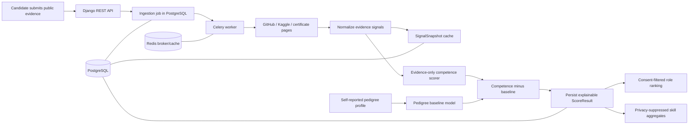

# Architecture and scoring

## Data flow

1. Candidate evidence links are stored separately from the candidate's self-reported profile. Ingestion requires explicit consent and is queued as an idempotent Celery job.
2. Source clients call GitHub/Kaggle APIs or safely fetch allowlisted verification pages. Successful normalized snapshots are reused until their configured TTL expires. A failed source is recorded; a score requires at least one successful source.
3. `CompetenceScorer` accepts only a mapping of known evidence source names to normalized payloads. The ingestion projection does not read or pass `CandidateProfile`; its strict field allowlist drops raw identity/pedigree keys and does not send profile columns to the embedder.
4. The Ridge pedigree baseline is a separate model using only `college_tier` and `employer_brand`; it never enters the competence scorer.

## Normalization and formulas

All source normalizers return a score from 0–100.

- **GitHub** = `min(45, recent_nonfork_fraction * 45) + min(20, public_repo_count * 2) + min(35, qualifying_substantive_repos * 5)`, capped at 100. A qualifying repository is non-forked, has a description or a README at least 300 characters, and has size at least 20 KB. Recent means updated in the last 365 days.
- **Kaggle** uses a supplied leaderboard percentile directly, clamped to 0–100, or computes `100 * (1 - zero_based_rank / (leaderboard_size - 1))`. It requires a supplied competition:team reference and a matching row.
- **Certificates** are assigned a conservative depth score only if a statically parsed verification page explicitly states the certificate/credential is valid or verified. Dynamic/unparseable pages are unverifiable and contribute zero.
- Across sources, competence is a weighted mean of the normalized scores. Verified ownership uses weight 1.0; unverified evidence uses configurable `UNVERIFIED_SIGNAL_WEIGHT` (default 0.65). Non-forked substantive GitHub projects can add a capped embedding-based README/description bonus (maximum 6), with embeddings loaded lazily. Tutorial exclusion currently uses transparent keyword heuristics; it is not a validated tutorial-replication classifier and does not inspect source code.
- **Pedigree delta** = `competence - baseline`; it is in [-100, 100].
- **Role fit** is the weighted fraction of required skill labels found in available public evidence text (0–100).
- **Ranking score** = `w_fit * role_fit + w_delta * ((delta + 100) / 2)`. Defaults are `w_fit=0.7`, `w_delta=0.3`. Delta normalization maps [-100,100] onto [0,100].

The sample pedigree dataset is synthetic. Its use is surfaced as `baseline_source: "sample_synthetic"` with a warning and must not be mistaken for a production-trained model.

## Privacy and isolation

Candidate score visibility requires candidate ownership or recruiter access to an explicitly consenting candidate. Insights expose only aggregate counts and averages and suppress each group below `INSIGHTS_MIN_GROUP_SIZE` (default 5). Do not add a per-candidate dimension to the aggregate endpoint.

## Known scoring limitations

The source scales and pedigree baseline are not trained against validated hiring outcomes. The bundled pedigree CSV is synthetic. GitHub analyzes API metadata and README/description text (README retrieval is capped at 25 repositories); it does not retrieve source code. Tutorial/replication exclusion uses keywords and fork metadata, not plagiarism detection. Role fit uses case-insensitive token-boundary text matching rather than embeddings. Insights use GitHub language labels as a proxy for skill categories. These are transparent first-release heuristics and require calibration on appropriate, consented data before employment decisions.
